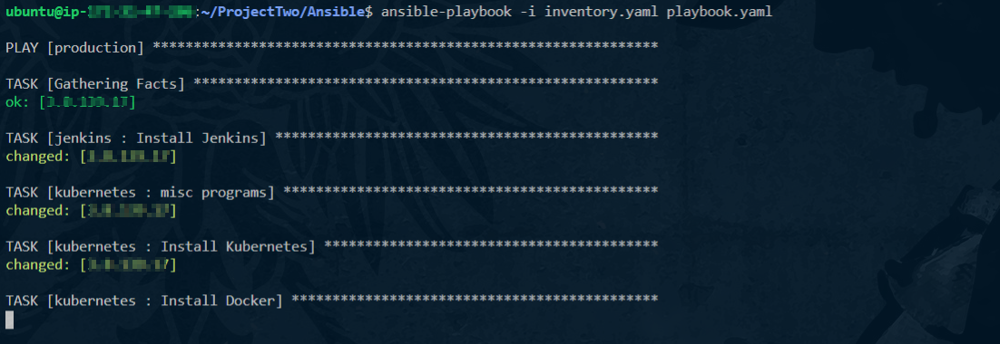
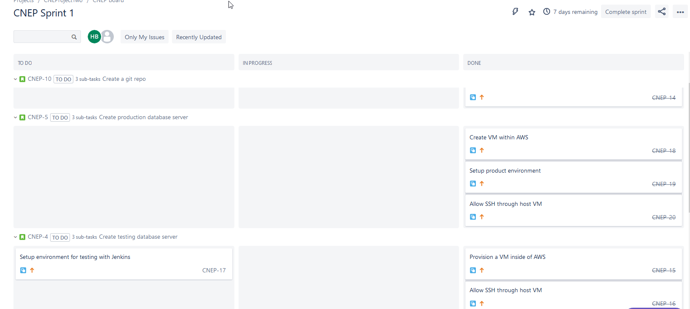

# CNEProjectTwo

# Introduction

For this project I have been tasked with creating a CI/CD pipeline in order to facicilate testing and deployment of a flask application.

## Requirements

The requirements for this project were as follows:

* A Testing VM to test new build deployments
* A deployment VM contain Kubernetes and Jenkins to facilitate automatic cluster deployment of a new image

# Infrastructure

The infrastructure is detailed below using the diagram.

This infrastructure is created to automatically deploy resources to create and host a flask application test/production environment and facilitate automatic deployment of new builds. 

This project utilised to following applications/hosts to fulfil:

* AWS
* Ansible
* Kubernetes
* Terraform
* Pytest

## AWS

AWS is a subsidiary of Amazon. They provide on-demand cloud computing platforms and APIs to a plethra of people.

In this project I use AWS to host all my services to fulfil the CI/CD pipeline.

### EC2s

### Security Group

### VPC

## Terraform

Terraform is devops tools used to deploy infrastructure on a automatic level. This allows you to create, deploy and manage virtual infrastructure

I used Terraform in this project to create the VMs needed to host Kubernetes and Jenkins, as well as the test deployment

## Ansible

Ansible is another devops tool used similarly to Terraform however instead of deploying infrastructure, it is used to deploy software across multiple hosts securely. This reduces the need for a user to remote into each individual machine to install applications. Instead you can use a series of _roles_,_playbooks_ and _inventory_ .yaml files to automate this process.

Below is my ansible in action

# Tracking my Project

In order to track my project I used **Jira**

I used the same _Kanban_ style workflow to track my progress through using sprints, stories and epics to track my progress along that way. 

Below is a snipet of a sprint being used during my project:

